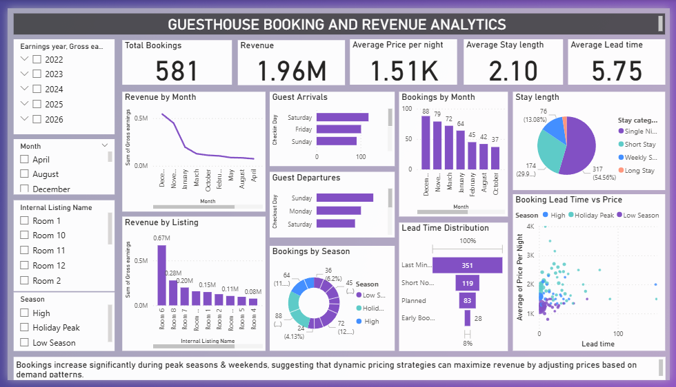
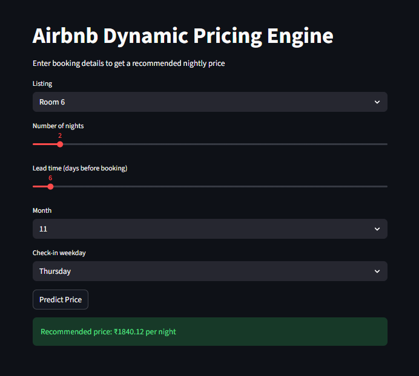

# Airbnb Dynamic Pricing & Demand Analytics

A data analytics and machine learning project that analyzes real booking behavior for a guesthouse Airbnb operation and builds a dynamic pricing engine based on demand patterns.

This project combines **data analysis, business insights, machine learning, and dashboarding** to demonstrate how data can support pricing decisions in the short-term rental industry.

---

# Business Problem

Short-term rental hosts must balance **pricing and occupancy** to maximize revenue.

Pricing too high reduces bookings, while pricing too low reduces profitability.  
Understanding **booking demand, seasonality, stay duration, and booking behavior** is essential to optimize nightly pricing.

This project analyzes **real booking data from 12 Airbnb listings** at Cirilo's Guesthouse to identify demand patterns and develop a **machine learning model for dynamic pricing recommendations**.

---

# Dataset

The dataset contains **581 booking records** collected from Cirilo's Guesthouse Airbnb listings.

### Key Features

| Feature | Description |
|------|------|
| booking_date | Date the booking was made |
| start_date | Guest check-in date |
| nights | Length of stay |
| lead_time | Days between booking and check-in |
| price_per_night | Nightly listing price |
| gross_earnings | Total booking revenue |

---

# Data Cleaning

The dataset was prepared using the following steps:

- Removed personally identifiable guest information
- Dropped unnecessary columns 
- Standardized date formats
- Created engineered features for demand analysis

### Engineered Features

- **month** – booking month
- **weekday** – check-in day
- **lead_time** – days between booking and stay
- **stay_category** – single night, short stay, weekly stay, long stay
- **booking_window** – last minute, short notice, planned, early booking
- **season** – high, peak holiday, low season
- **monthly_demand** – number of bookings per month

---

# Key Metrics

Industry metrics calculated in the analysis include:

- **Occupancy Rate**
- **Average Daily Rate (ADR)**
- **Revenue per Available Room (RevPAR)**
- **Booking Lead Time**
- **Average Stay Length**

---

# Power BI Dashboard

A Power BI dashboard was built to visualize booking performance and demand trends.

The dashboard highlights:

- Revenue performance
- Listing popularity
- Booking trends
- Guest behavior
- Seasonal demand patterns

---

# Business Insights

Key findings from the analysis:

- **Booking demand peaks during November – March**
- **Short stays dominate bookings**, with most guests staying **1–2 nights**
- **75% of bookings occur within 5 days before arrival**, indicating strong **last-minute demand**
- **Weekend check-ins are most common**, especially **Saturday**
- Guests most commonly **check out on Sunday or Monday**
- **Room 6 generates the highest number of bookings**
- A **small number of listings generate the majority of revenue**

### Revenue Insights

- Highest revenue occurs during **November and December**
- **Weekend stays command higher prices than weekday stays**
- **Longer stays receive lower nightly prices**

### Key Metrics

- **Average stay length:** 2.1 nights  
- **Average daily rate:** €1513.53  
- **Average booking value:** €3370.93  
- **Occupancy Rate through Airbnb:** 7.57%

---

# Machine Learning Dynamic Pricing Model

A machine learning model was developed to recommend optimal nightly prices based on booking patterns.

### Features Used

- listing
- nights
- lead_time
- month
- weekday
- monthly_demand
- stay_category
- booking_window
- season

These features capture **demand patterns, guest behavior, and seasonal effects** that influence pricing.

---

# Models Tested

Several machine learning models were trained and evaluated.

| Model | MAE | R² Score |
|------|------|------|
| Linear Regression | 270.48 | 0.35 |
| Random Forest | 247.78 | 0.49 |
| CatBoost | **234.42** | **0.53** |
| XGBoost | 275.72 | 0.38 |

**CatBoost produced the best performance**, capturing nonlinear relationships in booking demand.

---

# Dynamic Pricing Engine

The project includes an **interactive Streamlit application** that allows users to input booking details and receive a recommended nightly price.

Inputs include:

- listing
- number of nights
- booking lead time
- month
- weekday

The system then predicts a **recommended nightly price using the trained machine learning model**.

---

# Technology Stack

Python  
Pandas  
Scikit-learn  
CatBoost  
XGBoost  
Power BI  
Streamlit  

---

# Future Improvements

Potential enhancements include:

- Occupancy forecasting models
- Reinforcement learning for dynamic pricing
- Competitor price scraping
- Automated pricing recommendation system
- Real-time demand forecasting

---

# Project Structure
airbnb-dynamic-pricing-analysis
│
├── data
│ ├── raw_data.csv
│ └── processed_data.csv
│
├── notebooks
│ ├── 01_data_cleaning.ipynb
│ ├── 02_exploratory_analysis.ipynb
│ ├── 03_feature_engineering.ipynb
│ └── 04_dynamic_pricing_model.ipynb
│
├── visuals
│ └── powerbi_booking_analytics_dashboard.png
│ ├── bookings_by_month.png
│ ├── revenue_by_listing.png
│ ├── stay_length.png
│ └── lead_time.png
│ └── arrival_day.png
│ └── departure_day.png
│ └── feature_importance_random_forest.png
│ └── model_comparison.png
│ └── streamlit_pricing_app.png
│
├── src
│ ├── app.py
│ ├── pricing_model.pkl
│ └── feature_engineering.py
│
└── README.md

---

# Author

**Swizel Monteiro**  
Data Analyst @Cirilo's

Project focused on **exploratory data analytics, demand forecasting, and machine learning in hospitality pricing**.

